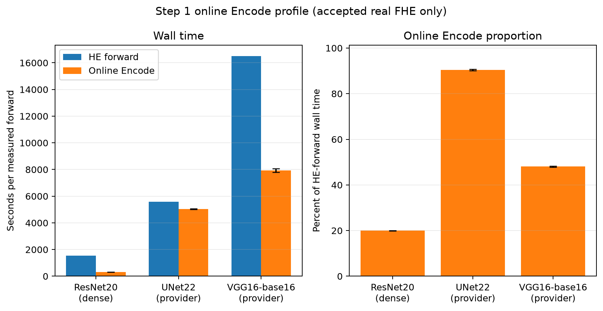
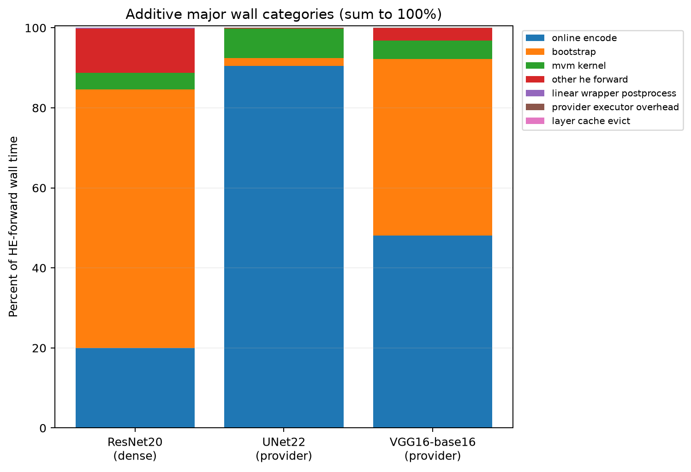
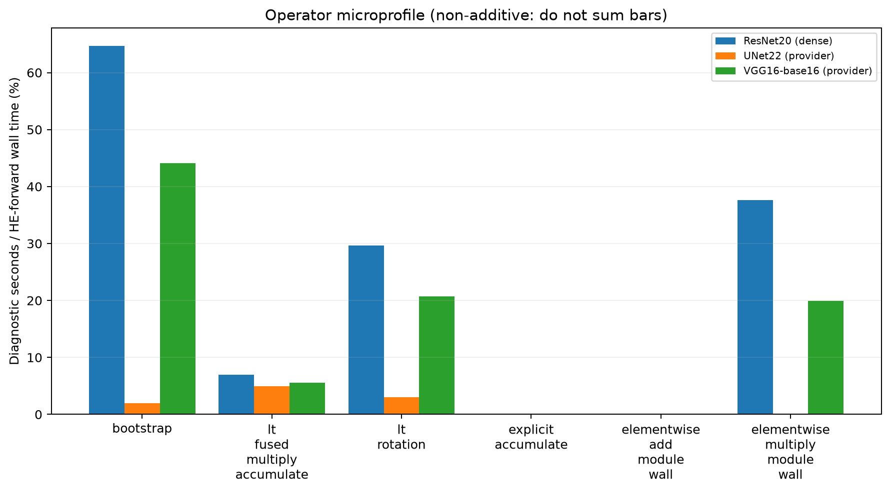
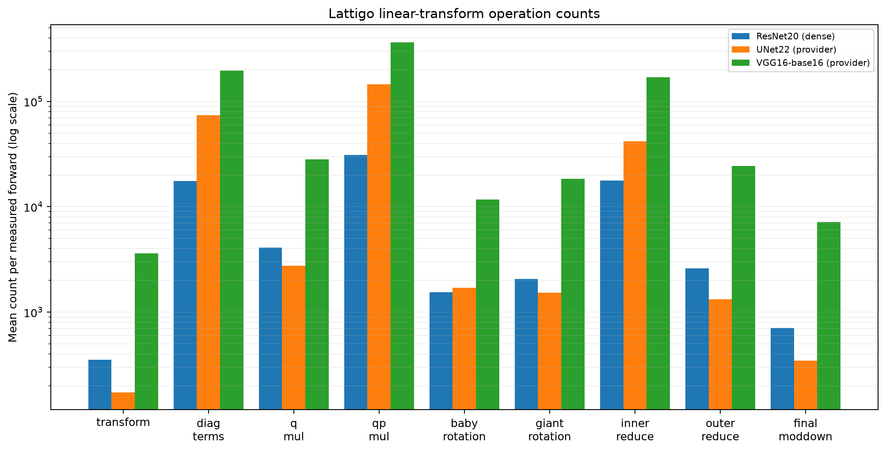

# Step 1: online Encode profiling

Three real-FHE profiles passed validation: ResNet20, U-Net22, and VGG16/base16. Each result uses one warmup followed by three measured forwards, one Encode worker, single-slot layer caching, and disabled streaming modes.

## Results

| Model | HE forward (s) | Online Encode (s) | Encode share | Bootstrap share | MVM share | MAE |
|---|---:|---:|---:|---:|---:|---:|
| ResNet20 | 1530.126 ± 13.282 | 305.403 ± 3.459 | 19.959% | 64.644% | 4.095% | 1.026e-4 |
| U-Net22 | 5575.576 ± 34.695 | 5044.205 ± 22.326 | 90.470% | 1.995% | 7.324% | 2.276e-8 |
| VGG16/base16 | 16508.112 ± 197.384 | 7937.350 ± 129.801 | 48.082% | 44.136% | 4.580% | 1.418e-4 |

Times are means ± sample standard deviation across the three measured forwards. All decrypted output shapes match their clear references. The additive wall-time categories close to 100% for every accepted result.

Online Encode accounts for most of U-Net22 inference, about half of VGG16 inference, and one fifth of ResNet20 inference. Variation between measured forwards is small.

U-Net22 is dominated by online Encode. ResNet20 is dominated by bootstrapping. VGG16 spends similar proportions on online Encode and bootstrapping. MVM kernels account for 4.1–7.3% across the three models; the remaining measured categories are comparatively small.

## Operator diagnostics

The operator microtimers are diagnostic and non-additive: nested or parallel measurements can overlap, so these percentages must not be summed. Rotation is substantial for ResNet20 and VGG16. Elementwise Multiply module time is also visible for those models, while measured Add time is negligible.

VGG16 has the highest count for every reported linear-transform operation. U-Net22 has fewer transforms than ResNet20 but substantially more diagonal terms and QP multiplications, consistent with its larger Encode workload.

## Notes

- The VGG16 clear-Lattigo structural run completed with the correct output shape but is excluded from all comparisons because it is not real FHE. Its MAE was `5.178e-3`, so it should not be used as numerical-accuracy evidence.
- The three accepted runs have valid schema-v2 profiles, matching requested and completed forward counts, and no failed attempts.
- Full-precision values are available in [`runs.csv`](runs.csv), [`attempts.csv`](attempts.csv), [`major_wall_categories.csv`](major_wall_categories.csv), [`operator_microprofile.csv`](operator_microprofile.csv), and [`operation_counts.csv`](operation_counts.csv).

The extracted statistics and figures were checked against the source JSON files. No obvious extraction, arithmetic, missing-data, or plotting errors were found.
