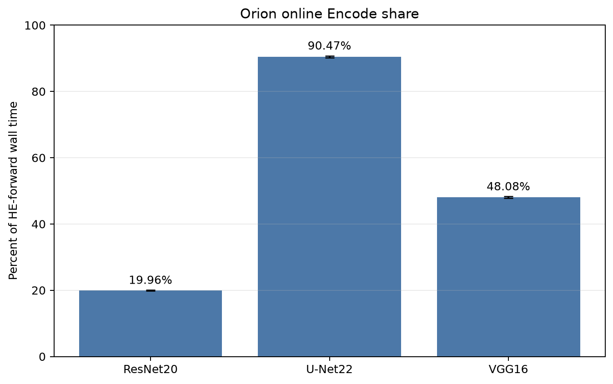
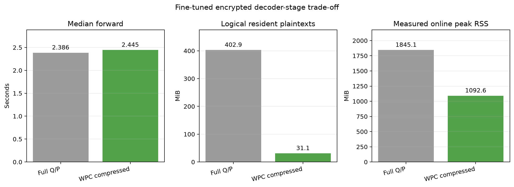

# WPC–Orion layout trade-off

## Result

The unchanged Orion layouts do not expose periodic learned-weight diagonals: the three-model census found **0** across ResNet20, U-Net22, and VGG16. U-Net's high online Encode share therefore does not make selective WPC compression of its existing Orion representation effective. The 14 U-Net candidates are verified structural concatenation transforms and cover only 0.016575% of encoded bytes.

Changing the decoder to WPC CIPS/Rotation Padding produces a different result. In the isolated fine-tuned encrypted decoder stage, compressed Q/P storage reduced logical resident plaintexts by **92.27%** (12.94x), reduced measured online peak RSS by **40.78%**, and increased median forward latency by **2.49%**. This is a decoder-stage result, not a complete encrypted U-Net result.

## Orion whole-model profiles

| Model | Mode | HE forward (s) | Online Encode (s) | Encode share | Bootstrap share | MVM share |
|---|---:|---:|---:|---:|---:|---:|
| ResNet20 | dense | 1530.13 | 305.40 | 19.96% | 64.64% | 4.10% |
| U-Net22 | provider | 5575.58 | 5044.21 | 90.47% | 1.99% | 7.32% |
| VGG16 | provider | 16508.11 | 7937.35 | 48.08% | 44.14% | 4.58% |

These are accepted real-FHE schema-v2 profiles. Major wall categories are additive and close to HE-forward time; non-additive operator microtimers are not used in this comparison.

## Periodicity of unchanged Orion layouts

| Model | Nonzero diagonals | Periodic learned weights | Periodic structural | Count coverage | Byte coverage | Selective ratio |
|---|---:|---:|---:|---:|---:|---:|
| ResNet20 | 8,381 | 0 | 0 | 0.000000% | 0.000000% | 1.000000x |
| U-Net22 | 73,077 | 0 | 14 | 0.019158% | 0.016575% | 1.000166x |
| VGG16 | 128,218 | 0 | 0 | 0.000000% | 0.000000% | 1.000000x |

The U-Net structural candidates passed exact encoded-Q/P reconstruction; they are not learned convolution, transposed-convolution, or linear weights.

## Fine-tuned WPC decoder stage

| Metric | Full Q/P | WPC compressed Q/P |
|---|---:|---:|
| Median forward | 2.385596 s | 2.444890 s |
| Logical resident plaintexts | 402.88 MiB | 31.12 MiB |
| Pre-online RSS | 1295.71 MiB | 913.78 MiB |
| Measured online peak RSS | 1845.06 MiB | 1092.64 MiB |

Median decompression was 149.836 ms (6.18% of compressed forward time). Both paths performed identical operations, and the maximum isolated output delta was 1.118e-08.

The separate FHE correctness gate used 56 compressed learned transforms, made zero online weight Encode calls, matched the full-Q/P output within 0.000e+00, and had maximum error 6.100e-07 against the independent clear reference.

## Rotation-Padding accuracy

| Configuration | Finite samples | Dice | IoU | Loss |
|---|---:|---:|---:|---:|
| Native zero padding | 2,115/2,115 | 0.942101 | 0.895599 | 0.147013 |
| Rotation Padding before fine-tuning | 2,114/2,115 | 0.831823 | 0.723345 | 6868.503358 |
| Rotation Padding after fine-tuning | 2,115/2,115 | 0.908467 | 0.842529 | 0.241691 |

Before fine-tuning, 1 samples were non-finite; affected aggregate metrics are finite-sample diagnostics rather than a directly comparable full-set result. Fine-tuning restored finite outputs for all 2,115 samples. The final Dice gap to native zero padding was -0.033634 (96.43% of native Dice retained).

## Conclusion and scope

The proposed explanation—high online Encode share implies that WPC can selectively compress many diagonals in the existing Orion U-Net layout—is not supported. Encode share and exact periodic learned-weight coverage are separate properties. WPC's benefit appears only after adopting its CIPS/Rotation-Padding layout: the trained decoder stage shows a large memory reduction with a small latency cost, while fine-tuning recovers numerical stability but leaves an accuracy gap to native zero padding.

The experiment does not yet establish a complete encrypted-network WPC-versus-Orion comparison. Such a claim requires matched end-to-end encrypted U-Net and ResNet executions under both layouts.

## Validation

All input schemas, acceptance gates, model identities, accounting closures, census JSONL counts, candidate classifications, encoded-Q/P verification, and cross-artifact checkpoint hashes were checked. `artifact_manifest.csv` and `synthesis.json` record the exact input paths, sizes, and SHA-256 hashes.
