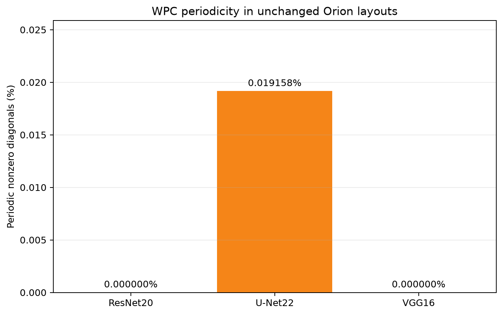
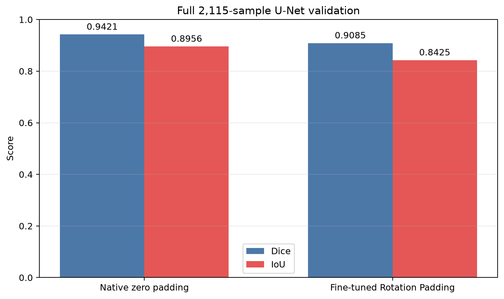

# Orion

> **FHE compression and online encoding overhead for privacy-preserving neural-network inference**

[](#)
[](https://www.python.org/)
[](https://go.dev/)
[](LICENSE)

This repository contains a computer science Honours thesis project built upon the existing **Orion** encrypted-inference framework. The research investigates the memory and runtime bottlenecks of weight-plaintext encoding in fully homomorphic encryption (FHE). 

To support this investigation, this project extends Orion's core architecture with validated profiling pipelines, memory-bounded execution models, and experimental compressed CKKS plaintext storage with online reconstruction.

## 2. Project Overview

Modern FHE inference systems can evaluate neural networks without decrypting their inputs, but their plaintext model parameters must first be converted into representation-specific polynomial objects. For convolutional and linear layers, this includes constructing packed matrix diagonals, CKKS slot encoding, residue number system (RNS) decomposition, and conversion to the number theoretic transform (NTT) representation used by the evaluator. Retaining every encoded plaintext reduces latency but creates a large memory footprint; regenerating them layer by layer saves memory but introduces substantial online Encode overhead.

This project studies that latency-memory trade-off in Orion. Its principal objectives are to:

- quantify online weight encoding as a proportion of real-FHE inference time;
- separate additive wall-time categories from overlapping operator diagnostics;
- maintain correctness under memory-bounded, single-slot layer caching;
- identify layout, packing, tiling, batching, and caching opportunities that reduce encoding work;
- evaluate whether periodic Weight Plaintext Compression (WPC) can be adapted to Orion's diagonal layouts; and
- preserve reproducible evidence across clear-backend correctness tests and real-Lattigo performance experiments.

### Technical stack

| Component | Role |
|---|---|
| Python 3.9–3.12 | Model definitions, graph lowering, packing, experiment orchestration, validation, and analysis |
| PyTorch | Clear reference models and tensor-level correctness checks |
| Go 1.24 | Native backend build and high-performance cryptographic execution |
| Lattigo v6.1.1 | RNS-CKKS encoding, linear transforms, key switching, rotations, and bootstrapping |
| NumPy / SciPy | Numerical processing and reference calculations |
| Matplotlib | Reproducible benchmark figures |

The Python frontend lowers neural-network operators into encrypted linear transforms and activation circuits. The Go/Lattigo backend performs the corresponding RNS-CKKS operations. A clear-Lattigo mode executes the same structural path without cryptographic arithmetic for local correctness validation; it does not model CKKS security, noise growth, or real-FHE runtime. Publishable performance results use the real-FHE backend.

### Experimental boundary

The primary Step 1 denominator, `he_forward_s`, is one encrypted model forward pass. It includes linear-transform/MVM kernels, online plaintext encoding, bootstrapping, layer-cache management, activation arithmetic, and runtime orchestration. It excludes compilation, cryptographic setup and key generation, clear inference, input encryption, and output decryption/decoding.

The principal metric is

```text
online_encode_pct_of_he_forward = 100 × online_encode_s / he_forward_s
```

The current experiments use `--io-mode none`; consequently, the reported shares measure local execution rather than network communication.

### Reproducibility entry points

```bash
python -m venv .venv
source .venv/bin/activate
python -m pip install --upgrade pip
python -m pip install -e .
python tools/build_lattigo.py
```

The native backend requires a working Go toolchain. Real-FHE model runs are resource intensive and should be executed on a suitably provisioned Linux server. See [`docs/step1_online_encode_profile.md`](docs/step1_online_encode_profile.md) for exact commands, environment constraints, and acceptance criteria.

WPC-specific entry points are documented in [Rotation-Padding fine-tuning](docs/wpc_rotation_padding_finetune.md), [the three-way CIPS benchmark](docs/wpc_online_encode_benchmark.md), [the matched-layout correctness gate](docs/wpc_orion_layout_gate.md), and [the repeated matched-layout benchmark](docs/wpc_matched_layout_benchmark.md). The server wrappers preserve raw artifacts and record completion status; existing evidence is not overwritten.

## 3. Current Progress

Verified evidence through **8 October 2026**. Whole-model Orion profiling, clear-model accuracy, and encrypted decoder-stage experiments have distinct scopes.

- **Step 0 — clear-Lattigo validation: complete.**
  - Established clear-Lattigo as the structural correctness backend before running expensive real-FHE experiments.
  - Verified ResNet20/CIFAR-10 and the U-Net22 provider path with matching output shapes and no threshold failures.
  - Confirmed that clear execution does not require linear-transform streaming; the legacy chunk-streaming path remains disabled.

- **Memory-bounded execution path: complete for the profiled models.**
  - Enabled single-slot layer caching so full encoded diagonal payloads do not remain resident for the entire network.
  - Added index-only metadata and runtime diagonal reconstruction for hybrid-packed `Linear` layers.
  - Preserved native physical-layout signatures through layout-transparent `Mult` and `Identity` operations.
  - Repaired the VGG16 provider path so its 32-ciphertext native layout is retained through the first activation and bootstrap boundary.

- **Step 1 — real-FHE online Encode profiling: complete.**
  - Collected one warmup and three measured forwards for ResNet20, U-Net22, and VGG16/base16 using one Encode worker.
  - Introduced the validated schema-v2 `step1_online_encode_profile` report.
  - Reset bootstrap counters per forward and sourced bootstrap wall time from the independently reset backend profile.
  - Separated additive wall-clock categories from nested or parallel operator microtimers.
  - Added accounting checks that reject missing, non-finite, negative, or non-closing category reports.
  - Added a schema-aware extractor that produces compact JSON, CSV, Markdown, and Matplotlib artifacts.

- **Step 2 — WPC analysis and unchanged-layout census: complete for the tested configurations.**
  - Documented how CIPS and Rotation Padding expose periodic encoded weights, per-plaintext and layer-level compression factors from the [WPC paper](https://dl.acm.org/doi/10.1145/3719027.3765022), and the distinction between resident storage and transient reconstruction buffers.
  - Audited ResNet20, U-Net22, and VGG16 Orion layouts: no periodic learned-weight diagonals were found. U-Net's 14 candidates are structural concatenation transforms, all verified by exact encoded-Q/P reconstruction.

- **Step 3 — WPC reproduction and Orion adaptation: implemented at functional and trained-decoder scope; full-model reproduction remains in progress.**
  - Implemented general `3×3` CIPS convolution, multi-ciphertext channel groups, sequential compressed-Q/P reconstruction/evaluation/release, and opt-in Orion layer integration.
  - Added activation/bootstrapping, downsampling/reshaping, residual and concatenation joins, transposed convolution, and a mini-U-Net correctness pipeline.
  - Validated a checkpoint-derived U-Net decoder with 56 learned transforms. The compressed path performs no online weight Encode and releases temporary full Q/P after evaluation.

- **Rotation-Padding fine-tuning and full validation: complete for the bounded protocol.**
  - Converted 18 spatial convolutions while retaining the trained degree-7 polynomial activations; completed five epochs on 2,048 training images with immutable checkpoints, finite-output audits, and rollback/retry handling.
  - Re-evaluated all 2,115 validation images after fine-tuning. Numerical stability was recovered, but accuracy remains below the native zero-padded checkpoint.

- **Controlled storage experiments: completed at decoder-stage scope.**
  - Extended isolated full/compressed tests to a three-way CIPS comparison of online Encode, resident full Q/P, and compressed Q/P: six balanced process blocks, 18 independent workers, and process-block confidence intervals.
  - Passed the scaled `LogN=12`, `16×16` CIPS feasibility gate and the five-treatment native-Orion/CIPS matched-function gate. These are diagnostic correctness/resource checks, not secure-deployment or complete-network benchmarks.

- **Validation and provenance: hardened.**
  - Added explicit finite-sample accounting, evaluated-checkpoint identities, cross-artifact SHA-256 checks, archived configurations, raw worker/RSS manifests, and read-only recomputation after transfer.
  - Replaced the previously unmeasured full-Q/P evaluation timer with an actual measurement in new workers; historical artifacts remain unchanged.
  - Independently checked the transferred Stage 30 archive and all five workers. The review identified repeated full-channel traversal in native online preparation; Stage 31 implements the block-aware correction before collecting repeated layout timings.

- **Stage 31 — repeated matched-layout benchmark: implemented; server results pending.**
  - Corrected native online preparation to traverse only the requested block's channel pairs, with exact-diagonal regression tests and no resident diagonal bank.
  - Added a ten-block, five-treatment balanced-order protocol, retained per-forward outputs/counters, independent raw-artifact review and paired process-block confidence intervals. No new latency finding is claimed before server validation.

- **Stage 32 — selective compression in unchanged Orion transforms: implemented; server gate pending.**
  - Added opt-in mixed periodic/nonperiodic Q/P materialization in the ordinary dense layer cache, preserving full-transform BSGS and online fallback recipes.
  - Added exact reconstruction/output/counter/release gates and separate backend Encode, preparation and decompression measurements. No new whole-model performance result is claimed. See [the scope and server commands](docs/wpc_selective_orion.md).

Remaining work includes executing the repeated balanced-order native-Orion/CIPS comparison and selective-storage gates, a security assessment of benchmark parameters, paper-aligned full-model reproduction and a separate U-Net extension, and matched complete encrypted-network experiments for U-Net and ResNet.

## 4. Results & Benchmarks

### Step 0: clear-Lattigo correctness

| Model | Input / mode | Status | Maximum layer MAE | Maximum absolute error | Structural observation |
|:---|:---|:---:|---:|---:|:---|
| ResNet20 | CIFAR-10, `32×32`, dense | Pass | `2.20e-6` | `1.10e-5` | Zero threshold failures |
| U-Net22 | `64×64`, provider | Pass | `7.85e-8` | `1.19e-6` | `enc1a` and `enc1b` each use four compact ciphertexts |

Clear-Lattigo results validate graph structure and numerical behavior but are not used as FHE performance evidence.

### Step 1: validated real-FHE profiles

| Model | Mode | `he_forward_s` | `online_encode_s` | `online_encode_pct_of_he_forward` | Bootstrap share | MVM share | Output MAE |
|:---|:---:|---:|---:|---:|---:|---:|---:|
| ResNet20 / CIFAR-10 | Dense | `1530.126 ± 13.282` | `305.403 ± 3.459` | **19.959%** | **64.644%** | 4.095% | `1.026e-4` |
| U-Net22 / 64 / base32 | Provider | `5575.576 ± 34.695` | `5044.205 ± 22.326` | **90.470%** | 1.995% | 7.324% | `2.276e-8` |
| VGG16 / base16 / ImageNet-224 | Provider | `16508.112 ± 197.384` | `7937.350 ± 129.801` | **48.082%** | **44.136%** | 4.580% | `1.418e-4` |

Values are means ± sample standard deviations over three measured forwards; one warmup is excluded. Every accepted run used real Lattigo FHE, single-slot layer caching, one Encode worker, and disabled streaming modes. All decrypted output shapes matched their clear references, and each schema-v2 additive category partition closed to the measured HE-forward wall time.

### Bottleneck classification

| Model | Dominant cost | Evidence | Immediate research implication |
|:---|:---|:---|:---|
| ResNet20 | Bootstrapping | 64.644% of HE-forward time | Prioritise bootstrap count, scheduling, level management, and ciphertext count at refresh boundaries |
| U-Net22 | Online Encode | 90.470% of HE-forward time | Prioritise encoded-weight reuse, compression, parallel encoding, and layout-aware reduction of diagonal plaintexts |
| VGG16/base16 | Mixed Encode and Bootstrap | 48.082% Encode; 44.136% Bootstrap | Evaluate joint layout/cache changes and bootstrap-aware packing |

The low 4.1–7.3% MVM shares limit the benefit of MVM-kernel-only optimisation under the measured configurations. The model matrix should not be interpreted as a controlled Dense-versus-Provider comparison because architecture and execution mode vary together; such a comparison requires paired runs of the same model and parameters.

The additive `major_wall_categories` values are suitable for wall-time partitions. The `operator_microprofile` timers are diagnostic and non-additive because nested or parallel measurements may overlap; they must not be summed into a runtime total. Full-precision results and provenance are available in [the extracted Step 1 report](.tmp/results/honours/06_step1_extracted/step1_profile_report.md).

### WPC eligibility in unchanged Orion layouts

| Model | Nonzero diagonal occurrences | Periodic learned weights | Periodic structural transforms | Encoded-byte coverage | Selective storage ratio |
|:---|---:|---:|---:|---:|---:|
| ResNet20 | 8,381 | 0 | 0 | 0.000000% | 1.000000× |
| U-Net22 | 73,077 | 0 | 14 | 0.016575% | 1.000166× |
| VGG16/base16 | 128,218 | 0 | 0 | 0.000000% | 1.000000× |

The 14 U-Net candidates passed exact encoded-Q/P verification and are concatenation materializers, not learned convolution or linear weights. VGG16 also had 169 all-zero occurrences, excluded from the nonzero denominator. Byte coverage and selective ratios describe aggregate logical census payloads, not measured resident memory or RSS.

**Finding:** high online Encode share does not imply WPC eligibility in an unchanged Orion layout. Selective compression of the observed periodic diagonals cannot address the dominant learned-weight workload. See [the evidence synthesis methodology](docs/wpc_orion_tradeoff_synthesis.md).

### Rotation-Padding fine-tuning: full clear-model validation

The COVID-19 U-Net22-plus-output Cheb7 model was fine-tuned for five epochs on 2,048 training images at `256×256`. Checkpoint selection used 512 validation images; the selected epoch-five checkpoint was then evaluated on the full 2,115-image validation split. This is not an untouched test set or an encrypted accuracy experiment.

| Configuration | Finite validation images | Dice | IoU | Loss |
|:---|---:|---:|---:|---:|
| Native zero padding | 2,115 / 2,115 | 0.942101 | 0.895599 | 0.147013 |
| Rotation Padding before fine-tuning — finite subset only | 2,114 / 2,115 | 0.831823 | 0.723345 | 6868.503358 |
| Rotation Padding after fine-tuning | 2,115 / 2,115 | 0.908467 | 0.842529 | 0.241691 |

The un-fine-tuned model produced one non-finite sample; its finite-subset metrics are not directly comparable with full-set results. Fine-tuning restored finite outputs throughout validation, but the final Dice gap to native zero padding was **−0.033634**. All five accepted checkpoints also passed no-update audits over the 2,048 training images. [Training protocol](docs/wpc_rotation_padding_finetune.md) and [validation/provenance recovery](docs/wpc_validation_provenance.md) document the acceptance criteria.

### Three-way CIPS storage benchmark — Stage 28

This experiment holds the fine-tuned checkpoint, synthetic internal features, CIPS layout, CKKS configuration, and homomorphic operations constant. It uses **functional-test parameters (`LogN=10`, `8×8` outputs), not secure-deployment parameters**. Each of six balanced process blocks contains three fresh workers, each with two warmups and ten measured forwards.

| Storage policy | Forward (s) | Encode share | Preparation + Encode share | Decompression share | Logical resident (MiB) | Sampled online peak RSS (MiB) |
|:---|---:|---:|---:|---:|---:|---:|
| Online Encode from slot-period recipes | 3.286573 | 26.490% | 31.258% | 0.000% | 2.097 | 1024.478 |
| Resident full Q/P | 2.280914 | 0.000% | 0.000% | 0.000% | 402.875 | 1838.489 |
| Compressed Q/P | 2.426713 | 0.000% | 0.000% | 6.406% | 31.124 | 1093.327 |

Forward entries are means of six process-block medians; share entries are means of six block medians of within-forward ratios. RSS entries average the six externally sampled measured-phase maxima. Logical plaintext storage excludes runtime object overhead, ciphertexts, and keys.

| Paired forward-latency ratio | Mean | 95% confidence interval for the mean |
|:---|---:|:---:|
| Compressed / online Encode | 0.738381 | [0.736169, 0.740582] |
| Compressed / full Q/P | 1.063997 | [1.057179, 1.071176] |

Confidence intervals use 10,000 percentile-bootstrap resamples of matched process blocks, not pooled forwards. In this same-CIPS workload, the full/compressed logical-resident storage ratio was **12.94×**. Compression had lower latency than online Encode but a modest latency cost relative to resident full Q/P; online recipes retained the smallest logical footprint. All 18 workers passed correctness checks; maximum measured clear-reference error was below `6.1e-7`.

Online workers performed 56 learned-transform Encode invocations per measured forward; the two preencoded policies performed zero. Preparation and Encode have different boundaries from historical Step 1 layer-cache categories and must not be substituted into whole-model profiles. This experiment isolates storage/materialization within CIPS; it does not establish the Orion-versus-WPC layout crossover. See [the Stage 28 methodology](docs/wpc_online_encode_benchmark.md).

### Matched native-Orion/CIPS decoder gate — Stage 30

Both layouts evaluate the same fine-tuned checkpoint, synthetic feature values, flattened Rotation Padding, trained Cheb7 activation, and bootstrap level schedule at `LogN=12` with `16×16` outputs. **The following timings are single-run diagnostics, not a latency ranking.** Each fresh worker performs an untimed correctness preflight followed by one measured forward, with no additional warmups. Cryptographic security has not been assessed.

| Layout / storage | Maximum clear error | Diagnostic forward (s) | Logical resident (MiB) | Sampled measured RSS (MiB) | LT rotations |
|:---|---:|---:|---:|---:|---:|
| Native Orion / full Q/P | `6.133e-7` | 11.414637 | 1118.766 | 3040.277 | 1456 |
| Native Orion / online Encode | `6.139e-7` | 59.046041 | 2.903 | 1898.363 | 1456 |
| CIPS / full Q/P | `6.167e-7` | 10.517926 | 1931.500 | 3981.949 | 1288 |
| CIPS / online Encode | `6.125e-7` | 15.551135 | 7.484 | 2186.090 | 1288 |
| CIPS / compressed Q/P | `6.181e-7` | 11.032202 | 99.772 | 2284.500 | 1288 |

All five paths passed the recorded `1e-5` tolerance; maximum output delta versus CIPS/full was **`2.980e-8`**. Operation counters matched across storage policies within each layout. CIPS used 1,288 rather than 1,456 LT rotations; this structural difference alone does not prove a speedup. Its compressed path verified exact Q/P reconstruction for all 56 learned transforms, performed zero online weight Encode, and released temporary materialization after evaluation.

At this geometry, CIPS compression reduced logical resident plaintext storage by **19.36×** relative to CIPS/full. The measured-phase sampled RSS was **42.63% lower** in this diagnostic run; that is neither the logical compression factor nor an OS-enforced allocation ceiling.

**Performance confound identified during raw-artifact review:** native online preparation consumed **41.986 s (71.1%)**, while its Encode call consumed **6.004 s (10.2%)**. Each requested block repeats full input/output-channel traversal before filtering unwanted entries. This avoidable work belongs to the experimental blockwise control, not the unchanged whole-model Orion layer cache, and must be corrected before repeated layout benchmarking. Native Encode includes allocation/binding call wall time; CIPS reports the narrower backend Encode timer, so those shares are not interchangeable.

The transferred archive passed checksum and byte-for-byte checks for all 28 files; the gate recomputed five workers and checked 20 raw artifact records, with no differences in the 36 selected source hashes. Checkpoint and backend-binary identities are recorded, but their contents were not bundled for local authentication. Commands, timer boundaries, and acceptance gates are documented in [the Stage 30 guide](docs/wpc_orion_layout_gate.md).

The accepted evidence is retained in the user-executed Stage 27 `server_run2`, Stage 28 `server_run2`, Stage 29 `server_run3`, and Stage 30 `server_run1` artifacts under `.tmp/results/honours/`. Failed or partial attempts are not used in these tables. The results support compressed-storage mechanics and matched decoder correctness; **a complete encrypted-network WPC-versus-Orion comparison, original-paper performance reproduction, and the ResNet/U-Net layout crossover remain unestablished**.

## 5. Visuals

### Online Encode latency and HE-forward proportion


This figure compares absolute HE-forward and online Encode latency while also exposing the different Encode proportions across the three validated real-FHE models.

### Additive HE-forward wall-time composition


The stacked categories form a validated partition of each model's HE-forward wall time. They show the transition from bootstrap-dominated ResNet20 to Encode-dominated U-Net22 and the mixed VGG16 profile.

### Non-additive operator diagnostics


These values provide operator-level diagnostic evidence but may overlap. They are intentionally presented separately from the additive wall-time accounting.

### Linear-transform operation counts


The log-scale plot compares transform, diagonal, modular multiplication, rotation, reduction, and final modulus-down counts. VGG16 has the largest count for every reported operation, while U-Net22's high diagonal and QP-multiplication counts are consistent with its large Encode workload.

### WPC periodicity in unchanged Orion layouts



The U-Net bar represents the 14 structural concatenation candidates: **0.019158% of nonzero occurrences**, not learned-weight coverage. All three models have zero periodic learned-weight candidates.

### Full validation after Rotation-Padding fine-tuning



Both plotted configurations produced finite outputs for all validation images. The accuracy gap remains after fine-tuning; the unstable pre-fine-tuning configuration is excluded from the full-set comparison. These two retained WPC figures were checked byte-for-byte against the provenance-revalidated Stage 27 synthesis artifacts.

Detailed methodology and interpretation guidance are maintained in [`docs/step1_online_encode_profile.md`](docs/step1_online_encode_profile.md). This research code is distributed under the [MIT License](LICENSE).
